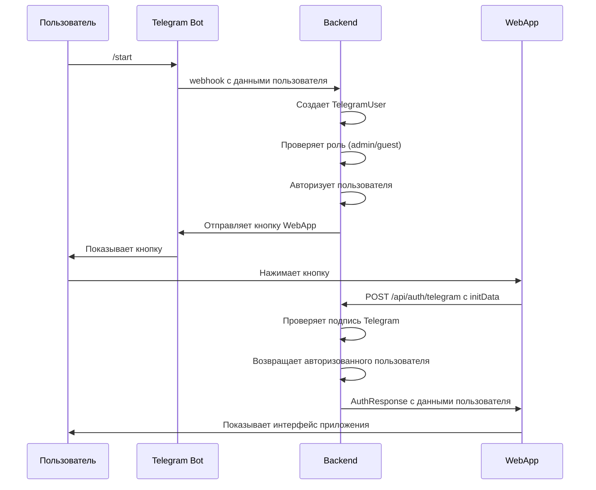

# 🔐 Руководство по настройке авторизации на уровне бота

## ✅ Что реализовано:

### **1. Система авторизации**
- **Автоматическая авторизация** при первом обращении к боту
- **Проверка прав доступа** на основе ролей
- **Управление пользователями** через бота
- **Интеграция с WebApp** для seamless входа

### **2. Команды бота**
- `/start` - 🚀 Запустить бота и войти в приложение
- `/login` - 🔐 Войти в приложение расписания
- `/help` - ❓ Показать справку по боту
- `/status` - 📊 Проверить статус бота
- `/myinfo` - 👤 Показать информацию о пользователе

### **3. Роли и права**
- **Гость** - базовый доступ к просмотру
- **Студент** - просмотр расписания своей группы
- **Староста** - редактирование расписания группы
- **Администратор** - полный доступ ко всем функциям

## 🚀 Настройка и запуск:

### **Шаг 1: Запустите сервер**
```bash
uvicorn app.main:app --reload --host 0.0.0.0 --port 8000
```

### **Шаг 2: Настройте бота**
```bash
python bot_setup.py
```

### **Шаг 3: Протестируйте авторизацию**
1. Откройте бота: https://t.me/scheduleSPAbot
2. Отправьте `/start`
3. Нажмите кнопку "Открыть расписание"
4. Проверьте авторизацию командой `/myinfo`

## 🔧 Как работает авторизация:

### **1. Первое обращение к боту**
```python
# Пользователь отправляет /start
# Бот создает объект TelegramUser
telegram_user = TelegramUser(
    id=user_id,
    first_name=first_name,
    last_name=last_name,
    username=username,
    role=UserRole.GUEST
)

# Проверяет, является ли администратором
if username and username.lower() == "david_nazaryan":
    telegram_user.role = UserRole.ADMIN

# Авторизует пользователя
bot_auth.authorize_user(telegram_user)
```

### **2. Проверка прав доступа**
```python
# Получение прав пользователя
permissions = bot_auth.get_user_permissions(user_id)

# Проверка конкретного права
if permissions["can_edit"]:
    # Пользователь может редактировать
    pass
```

### **3. Интеграция с WebApp**
```javascript
// В WebApp проверяется initData от Telegram
const initData = window.Telegram.WebApp.initData;

// Отправляется на сервер для аутентификации
const response = await fetch('/api/auth/telegram', {
    method: 'POST',
    body: formData
});
```

## 📱 Пользовательский опыт:

### **1. Вход через бота**
1. Пользователь открывает бота
2. Отправляет `/start` или `/login`
3. Бот показывает кнопку WebApp
4. Пользователь нажимает кнопку
5. Открывается WebApp с авторизацией

### **2. Проверка статуса**
- `/myinfo` - показывает информацию о пользователе
- `/status` - показывает статус бота
- `/help` - показывает справку

### **3. Управление правами**
- Администраторы могут управлять всеми группами
- Старосты могут управлять своей группой
- Студенты могут только просматривать

## 🛡️ Безопасность:

### **1. Проверка подписи Telegram**
```python
def verify_telegram_data(self, init_data: str) -> Optional[TelegramUser]:
    # Проверяем подпись данных от Telegram
    if not self._verify_hash(data_dict, hash_value):
        return None
```

### **2. Авторизация на уровне бота**
```python
def authorize_user(self, user: TelegramUser) -> bool:
    # Сохраняем пользователя в системе
    user_manager.add_user(user)
    
    # Добавляем в список авторизованных
    self.authorized_users[user.id] = user
```

### **3. Проверка прав доступа**
```python
def get_user_permissions(self, user_id: int) -> Dict[str, bool]:
    user = self.authorized_users.get(user_id)
    if not user:
        return {"can_view": False, ...}
    
    return {
        "can_view": True,
        "can_edit": user.role == UserRole.MONITOR,
        "can_manage_users": user.role == UserRole.MONITOR or can_manage_all_groups(user),
        "can_manage_all_groups": can_manage_all_groups(user),
        "is_admin": can_manage_all_groups(user)
    }
```

## 🎯 Преимущества:

### **1. Удобство использования**
- ✅ **Один клик** для входа в приложение
- ✅ **Автоматическая авторизация** при первом обращении
- ✅ **Seamless интеграция** с Telegram

### **2. Безопасность**
- ✅ **Проверка подписи** Telegram
- ✅ **Ролевая модель** доступа
- ✅ **Централизованное управление** пользователями

### **3. Гибкость**
- ✅ **Легко добавлять** новые роли
- ✅ **Гранулярные права** доступа
- ✅ **Интеграция с WebApp**

## 🔄 Процесс авторизации:



## 🚨 Отладка:

### **Проверьте логи сервера:**
```bash
# Должны видеть:
INFO: webhook received from user_id: 123456789
INFO: User authorized: David Nazaryan (admin)
INFO: WebApp button sent to chat_id: 123456789
```

### **Проверьте команды бота:**
```bash
# Отправьте в бота:
/start
/myinfo
/status
/help
```

### **Проверьте WebApp:**
```javascript
// В консоли браузера:
console.log(window.Telegram.WebApp.initData);
console.log(authManager.currentUser);
```

## 🎉 Готово!

Теперь у вас есть полноценная система авторизации на уровне бота:

1. **Пользователи** входят через Telegram бота
2. **Авторизация** происходит автоматически
3. **Права доступа** проверяются на каждом запросе
4. **WebApp** интегрирован с системой авторизации
5. **Администраторы** могут управлять всеми группами

Ваш бот готов к использованию! 🚀

