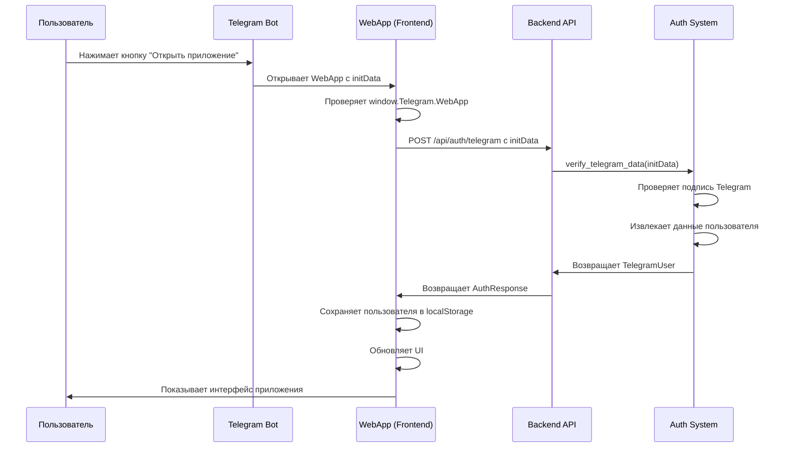

# Процесс входа через Telegram

## 🔄 Общая схема аутентификации



## 📱 1. Запуск WebApp в Telegram

### **Как это происходит:**
1. Пользователь нажимает кнопку бота в Telegram
2. Telegram открывает WebApp с передачей `initData`
3. `initData` содержит зашифрованные данные пользователя

### **Что передается в initData:**
```javascript
// Пример initData от Telegram
"user=%7B%22id%22%3A123456789%2C%22first_name%22%3A%22David%22%2C%22last_name%22%3A%22Nazaryan%22%2C%22username%22%3A%22david_nazaryan%22%7D&chat_instance=-123456789&chat_type=private&auth_date=1234567890&hash=abc123def456"
```

**Расшифрованные данные:**
```json
{
  "user": {
    "id": 123456789,
    "first_name": "David",
    "last_name": "Nazaryan", 
    "username": "david_nazaryan"
  },
  "chat_instance": "-123456789",
  "chat_type": "private",
  "auth_date": 1234567890,
  "hash": "abc123def456"
}
```

## 🔍 2. Проверка в Frontend

### **JavaScript код:**
```javascript
async init() {
    // Проверяем, запущено ли приложение в Telegram
    if (window.Telegram && window.Telegram.WebApp) {
        await this.authenticateWithTelegram();
    } else {
        // Показываем модальное окно для тестирования
        this.showAuthModal();
    }
}

async authenticateWithTelegram() {
    try {
        // Получаем initData от Telegram
        const initData = window.Telegram.WebApp.initData;
        const groupId = this.getGroupIdFromUrl();
        
        // Отправляем на сервер для проверки
        const formData = new FormData();
        formData.append('init_data', initData);
        if (groupId) {
            formData.append('group_id', groupId);
        }
        
        const response = await fetch('/api/auth/telegram', {
            method: 'POST',
            body: formData
        });
        
        const result = await response.json();
        
        if (result.success) {
            this.currentUser = result.user;
            this.updateUI();
            // ... остальная логика
        }
    } catch (error) {
        console.error('Ошибка аутентификации:', error);
    }
}
```

## 🔐 3. Проверка на Backend

### **API эндпоинт:**
```python
@app.post("/api/auth/telegram", response_model=AuthResponse)
async def authenticate_telegram(
    init_data: str = Form(...),
    group_id: Optional[str] = Form(None)
) -> AuthResponse:
    """Аутентификация через Telegram WebApp"""
    from .auth import auth
    
    # Проверяем данные от Telegram
    user = auth.verify_telegram_data(init_data)
    if not user:
        return AuthResponse(
            user=UserResponse(id=0, first_name="", role="guest"),
            success=False,
            message="Не удалось аутентифицировать пользователя"
        )
    
    # Устанавливаем группу, если передана
    if group_id:
        user.group_id = group_id
    
    # Сохраняем пользователя в системе
    user_manager.add_user(user)
    
    return AuthResponse(
        user=UserResponse(
            id=user.id,
            first_name=user.first_name,
            last_name=user.last_name,
            username=user.username,
            role=user.role.value,
            group_id=user.group_id
        ),
        success=True,
        message="Аутентификация успешна"
    )
```

## 🛡️ 4. Проверка подписи Telegram

### **Функция verify_telegram_data:**
```python
def verify_telegram_data(self, init_data: str) -> Optional[TelegramUser]:
    """Проверяем данные от Telegram WebApp"""
    try:
        # Парсим данные
        data_pairs = init_data.split('&')
        data_dict = {}
        hash_value = None
        
        for pair in data_pairs:
            if '=' in pair:
                key, value = pair.split('=', 1)
                if key == 'hash':
                    hash_value = value
                else:
                    data_dict[key] = value
        
        if not hash_value:
            return None
        
        # Проверяем подпись (критически важно!)
        if not self._verify_hash(data_dict, hash_value):
            return None
        
        # Извлекаем данные пользователя
        user_data = json.loads(data_dict.get('user', '{}'))
        
        return TelegramUser(
            id=user_data.get('id'),
            first_name=user_data.get('first_name', ''),
            last_name=user_data.get('last_name'),
            username=user_data.get('username'),
            photo_url=user_data.get('photo_url'),
            role=UserRole.GUEST,  # По умолчанию гость
            group_id=None
        )
    except Exception as e:
        print(f"Ошибка проверки данных Telegram: {e}")
        return None
```

## 🔑 5. Проверка подписи (Критически важно!)

### **Функция _verify_hash:**
```python
def _verify_hash(self, data_dict: dict, hash_value: str) -> bool:
    """Проверяем подпись данных от Telegram"""
    try:
        # Создаем строку для проверки
        data_check_string = '\n'.join([
            f"{key}={value}" 
            for key, value in sorted(data_dict.items()) 
            if key != 'hash'
        ])
        
        # Создаем секретный ключ
        secret_key = self._get_secret_key()
        
        # Вычисляем HMAC-SHA256
        hmac_hash = hmac.new(
            secret_key,
            data_check_string.encode(),
            hashlib.sha256
        ).hexdigest()
        
        # Сравниваем с переданным хешем
        return hmac_hash == hash_value
        
    except Exception as e:
        print(f"Ошибка проверки подписи: {e}")
        return False
```

## 🎯 6. Определение роли пользователя

### **Логика назначения роли:**
```python
# После успешной аутентификации
if user.username and user.username.lower() == "david_nazaryan":
    user.role = UserRole.ADMIN
elif group_id:
    # Проверяем, есть ли пользователь в группе
    existing_user = user_manager.get_user(user.id)
    if existing_user:
        user.role = existing_user.role
        user.group_id = existing_user.group_id
    else:
        user.role = UserRole.STUDENT
        user.group_id = group_id
else:
    user.role = UserRole.GUEST
```

## 💾 7. Сохранение состояния

### **В localStorage:**
```javascript
// Сохраняем пользователя для последующих сессий
localStorage.setItem('test_user', JSON.stringify(this.currentUser));

// При следующем запуске
const savedUser = localStorage.getItem('test_user');
if (savedUser) {
    this.currentUser = JSON.parse(savedUser);
    this.updateUI();
}
```

## 🔄 8. Обновление UI

### **После успешной аутентификации:**
```javascript
updateUI() {
    // Обновляем отображение пользователя в настройках
    const userInfo = document.getElementById('user-info');
    if (userInfo && this.currentUser) {
        userInfo.innerHTML = `
            <div class="user-avatar-settings">
                ${this.currentUser.photo_url ? 
                    `` : 
                    `${this.currentUser.first_name[0]}`
                }
            </div>
            <div class="user-details-settings">
                <div class="user-name-settings">${this.currentUser.first_name} ${this.currentUser.last_name || ''}</div>
                <div class="user-role-settings">${this.getRoleDisplayName(this.currentUser.role)}</div>
                <div class="user-id-settings">ID: ${this.currentUser.id}</div>
                ${this.currentUser.group_id ? `<div class="user-group-settings">Группа: ${this.currentUser.group_id}</div>` : ''}
            </div>
        `;
        userInfo.style.display = 'flex';
    }
    
    // Показываем соответствующие элементы
    this.updatePermissionBasedUI();
}
```

## 🚨 9. Обработка ошибок

### **Возможные ошибки:**
1. **Неверная подпись** - данные подделаны
2. **Отсутствие initData** - приложение запущено не в Telegram
3. **Неверный формат данных** - поврежденные данные
4. **Ошибка сети** - проблемы с подключением

### **Обработка в коде:**
```javascript
try {
    const result = await response.json();
    
    if (result.success) {
        // Успешная аутентификация
        this.currentUser = result.user;
        this.updateUI();
    } else {
        // Ошибка аутентификации
        this.showNotification(result.message, "error");
        this.showAuthModal();
    }
} catch (error) {
    console.error('Ошибка аутентификации:', error);
    this.showNotification("Ошибка подключения", "error");
    this.showAuthModal();
}
```

## 🔧 10. Настройка для продакшена

### **Требуется настроить:**
1. **Bot Token** в переменных окружения
2. **Webhook URL** для бота
3. **Домен** для WebApp
4. **HTTPS** обязательно для Telegram

### **Пример настройки:**
```python
# В .env файле
TELEGRAM_BOT_TOKEN=your_bot_token_here
TELEGRAM_WEBHOOK_URL=https://yourdomain.com/webhook
```

## 🎯 Преимущества этого подхода:

1. **Безопасность** - проверка подписи Telegram
2. **Удобство** - автоматический вход без паролей
3. **Надежность** - данные приходят напрямую от Telegram
4. **Гибкость** - поддержка тестового режима
5. **Масштабируемость** - легко добавить новые роли

## 🚀 Итоговый процесс:

1. **Пользователь** нажимает кнопку в Telegram
2. **Telegram** открывает WebApp с `initData`
3. **Frontend** отправляет данные на сервер
4. **Backend** проверяет подпись и извлекает данные
5. **Система** определяет роль пользователя
6. **UI** обновляется в соответствии с правами
7. **Пользователь** получает доступ к функциям

Этот процесс обеспечивает безопасную и удобную аутентификацию через Telegram! 🎉

